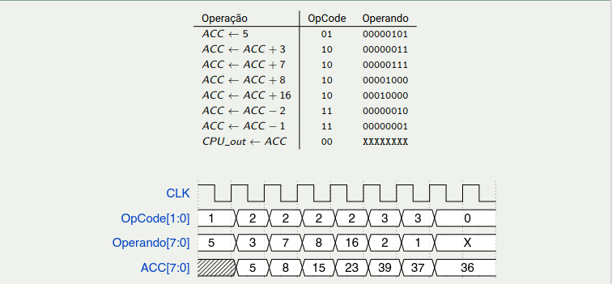

# Implementando calculadora rudimentar 

- Essa atividade visa mostrar a diferença entre a implementação paralela de hardware puro e o aproveitamento de hardware com blocos. Abaixo temos uma tabela de comparação entre os estilos de implmenentação:

1. Implementação paralela:
    - 4 somadores e 2 subtratores
    - Entrada dos operandos em paralelo
    - Fixa, apenas para expressão projetada

2. Rudi:
    - 1 somador, 2 multiplexadores, 1 decodificador e 1 registrador
    - Entrada dos operandos sequenciais
    - Flexível, pode implementar qualquer expressão com soma e subtração

- Essa calculadora funciona passando manualmente a opção que deseja se feita e o operando, com isso, temos o funcionamento de incremento, decremento entre os valores.

